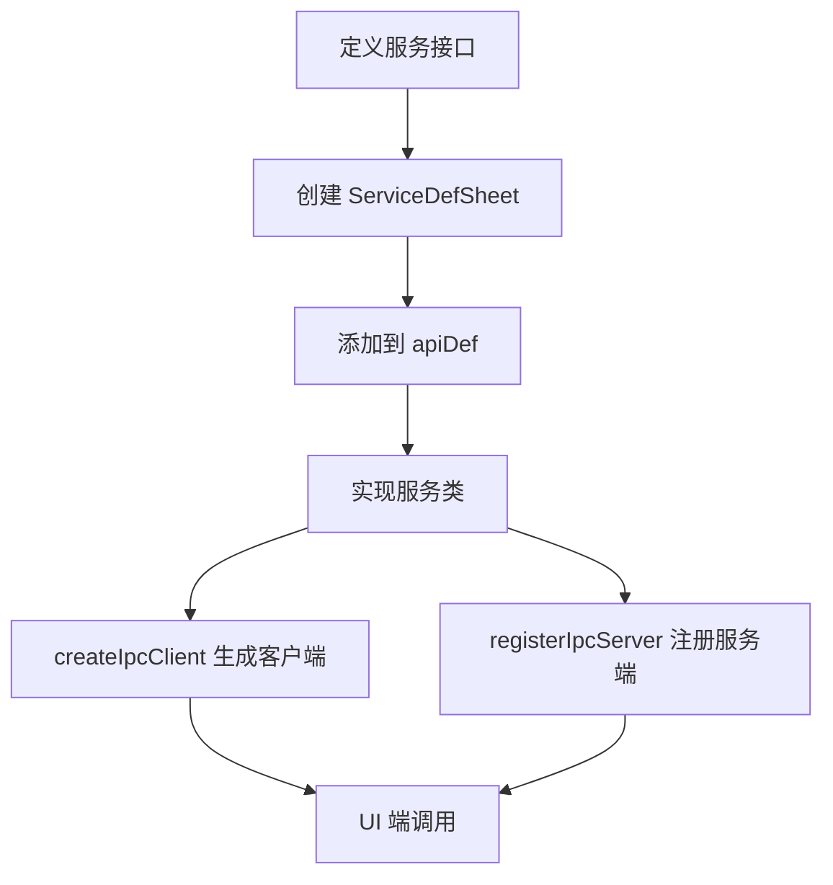

# 服务接口开发指南

本文档说明：

- 如何在现有 `service` 下新增一个 API `method`
- 如何新增一个全新的 API `service`

新的架构使用动态创建方式，通过 `apiDef` 和 `ServiceDefSheet` 自动生成客户端和服务端代码。

---

## 一、术语与约定

- `unary`：一次请求一次响应（使用 `ipcMain.handle` / `ipcRenderer.invoke`）。
- `server streaming`：一次请求，多次从服务端推送响应（使用 `ipcMain.on` + `MessagePort`）。
- 通道命名：统一为 `svcName.methodName`，例如：`svcState.getConfig`。
- `ServiceDefSheet`：定义服务方法的类型（`unary` 或 `serverStreaming`）。
- `apiDef`：聚合所有服务的定义，用于动态创建客户端和服务端。

---

## 二、在现有 service 下新增一个 method

以下以在 `svcState` 下新增一个 `ping` 方法为例。

1. 在服务接口中定义方法签名

在 `packages/app/src/shared/api/svcState.ts` 中为 `StateSvc` 接口增加方法签名，并定义请求/响应类型：

```ts
// packages/app/src/shared/api/svcState.ts （示例片段）
export type PingReq = { message: string }
export type PingResp = { echo: string }

export type StateSvc = {
  // 已有方法...
  ping(req: PingReq): Promise<PingResp>
}
```

2. 在服务定义中添加方法类型

在同一个文件的 `stateSvcDef` 中添加新方法的类型定义：

```ts
// packages/app/src/shared/api/svcState.ts （示例片段）
export const stateSvcDef: ServiceDefSheet<StateSvc> = {
  // 已有方法...
  ping: {
    type: 'unary'
  }
}
```

3. 在 Main 进程实现具体逻辑

在 `packages/app/src/main/api/svcStateImpl.ts` 中实现 `ping` 方法：

```ts
// packages/app/src/main/api/svcStateImpl.ts （示例片段）
import { StateSvc, PingReq, PingResp } from '@shared/api/svcState'

export class StateSvcImpl implements StateSvc {
  // 已有实现...
  async ping(req: PingReq): Promise<PingResp> {
    return { echo: `pong: ${req.message}` }
  }
}
```

4. UI 端调用（示例）

```ts
// 任意 Renderer 代码中（示例）
const resp = await window.api.svcState.ping({ message: 'hello' })
console.log(resp.echo)
```

若新增方法为流式响应：

- 在接口中将方法签名定义为 `(req, resp: ServerStreaming<T>) => Promise<void>`
- 在 `ServiceDefSheet` 中设置 `type: 'serverStreaming'`

---

## 三、新增一个全新的 service

以下以新增 `svcFoo` 为例（含一个 unary 方法 `hello` 与一个流式方法 `watch`）。

1. 创建服务接口文件

```ts
// packages/app/src/shared/api/svcFoo.ts
import { ServerStreaming } from './apiUtils/streaming'
import { ServiceDefSheet } from './apiUtils/serviceDefSheet'

export type HelloReq = { name: string }
export type HelloResp = { greeting: string }

export type WatchReq = { topic: string }
export type WatchResp = { data: string }

export type FooSvc = {
  hello(req: HelloReq): Promise<HelloResp>
  watch(req: WatchReq, resp: ServerStreaming<WatchResp>): Promise<void>
}

export const fooSvcDef: ServiceDefSheet<FooSvc> = {
  hello: {
    type: 'unary'
  },
  watch: {
    type: 'serverStreaming'
  }
}
```

2. 将新服务添加到 API 定义

```ts
// packages/app/src/shared/api/index.ts （示例片段）
import { FooSvc, fooSvcDef } from './svcFoo'

export type Api = {
  // 已有 svc...
  svcFoo: FooSvc
}

export const apiDef: ApiDefSheet<Api> = {
  // 已有服务...
  svcFoo: fooSvcDef
}
```

3. 在 Main 进程实现服务

```ts
// packages/app/src/main/api/svcFooImpl.ts
import { FooSvc, HelloReq, HelloResp, WatchReq, WatchResp } from '@shared/api/svcFoo'
import { ServerStreaming } from '@shared/api/apiUtils/streaming'

export class FooSvcImpl implements FooSvc {
  async hello(req: HelloReq): Promise<HelloResp> {
    return { greeting: `Hi, ${req.name}!` }
  }

  async watch(req: WatchReq, resp: ServerStreaming<WatchResp>): Promise<void> {
    resp.onData({ data: `start: ${req.topic}` })
    // 根据需要推送更多数据
  }
}
```

4. 在服务端注册新服务

```ts
// packages/app/src/main/api/serverIpc.ts （示例片段）
import { FooSvcImpl } from './svcFooImpl'

const createServer = (): Api => {
  return {
    // 已有服务...
    svcFoo: new FooSvcImpl()
  }
}
```

---

## 四、动态创建机制说明

新的架构通过以下机制实现自动化的客户端和服务端创建：

### 核心组件

1. **ServiceDefSheet**：定义每个服务方法的类型（`unary` 或 `serverStreaming`）
2. **ApiDefSheet**：聚合所有服务的定义
3. **createIpcClient**：根据 `apiDef` 动态生成客户端代理
4. **registerIpcServer**：根据 `apiDef` 动态注册服务端处理器

### 工作流程



### 优势

- **自动化**：无需手动编写客户端和服务端注册代码
- **类型安全**：基于 TypeScript 接口自动生成类型定义
- **一致性**：统一的命名和调用方式
- **可维护性**：新增服务只需定义接口和实现类

---

## 五、流式调用注意事项

- 预加载侧通过 `MessageChannel` 传入 `MessagePort`，并在 `onmessage` 中将服务端的 `data` 或 `error` 转换回调。
- 主进程侧需要 `port.start()`，并在结束时 `port.close()`；错误需包装为 `ServerStreamingError` 发送。
- 若支持取消/中止，可使用 `newAbortHandler()`，当端口 `message` 或 `close` 时触发 `abort`。

---

## 六、命名与调试建议

- 通道名统一：`svcName.methodName`。
- 充分利用主/渲染进程中的日志：两侧均打印了 `req/resp/time` 便于排查。
- 使用 TypeScript 严格模式确保类型安全。

---

## 七、架构设计原则

本框架面向 Electron 应用的主/渲染进程分层与安全模型，目标是：

- **清晰的职责边界**：UI 只关心调用接口，业务与系统能力由 Main 承担。
- **一致的开发体验**：新增 `service/method` 有固定路径、固定命名、固定注册位置。
- **可观测与可维护**：统一日志、结构化错误、可取消的流式调用与明确的生命周期。
- **类型安全与隔离**：共享类型定义在 `@shared/api/`，Renderer 暴露为"简单对象（Plain Object）"。

### 设计原则

- **分层解耦**：`Renderer(Preload)` 仅做"桥接 + 调用"，`Main` 负责"实现 + 资源访问"。
- **显式路由**：通道名统一为 `svcName.methodName`，查找/排查容易。
- **单一通信原语**：
  - 一次性请求用 `invoke/handle`（unary）。
  - 多次推送用 `postMessage + MessagePort`（server streaming）。
- **可取消与可回收**：流式调用内置 `AbortHandler`，端口关闭即触发中止，避免资源泄漏。
- **错误即数据**：错误通过 `ServerStreamingError` 结构化传输，保证前后端一致处理。

### 关键机制与取舍

- **动态创建机制**：
  - 通过 `ServiceDefSheet` 和 `ApiDefSheet` 自动生成客户端和服务端代码。
  - 减少手动注册代码，降低出错概率。
- **类型边界清晰**：
  - `@shared/api` 定义 `Api`、各 `Svc` 接口与请求/响应类型，避免隐式 `any` 与两端类型漂移。
  - Renderer 侧只导出"简单对象"，遵循 Electron `contextBridge` 的限制与最佳实践。
- **流式优先的实时反馈**：
  - 长耗时任务用流式推送进度，提升可用性与可观测性。
  - 通过 `MessagePort.start/close` 明确生命周期，异常时将错误封装回传。
- **日志与诊断**：
  - 统一打印 `req/resp/time`，可快速定位性能瓶颈与异常链路。

### 维护与扩展的收益

- **新增能力成本低**：按"新增 method/新增 service"的步骤即可，无需改动框架代码。
- **实现可替换**：通过接口注入具体 `Impl`，便于 Mock/替换/单测。
- **安全默认**：Renderer 不暴露 Node 能力；所有系统资源访问集中在 Main，利于审计与控制。
- **一致命名和目录结构**，使得团队成员更容易导航与协作。
